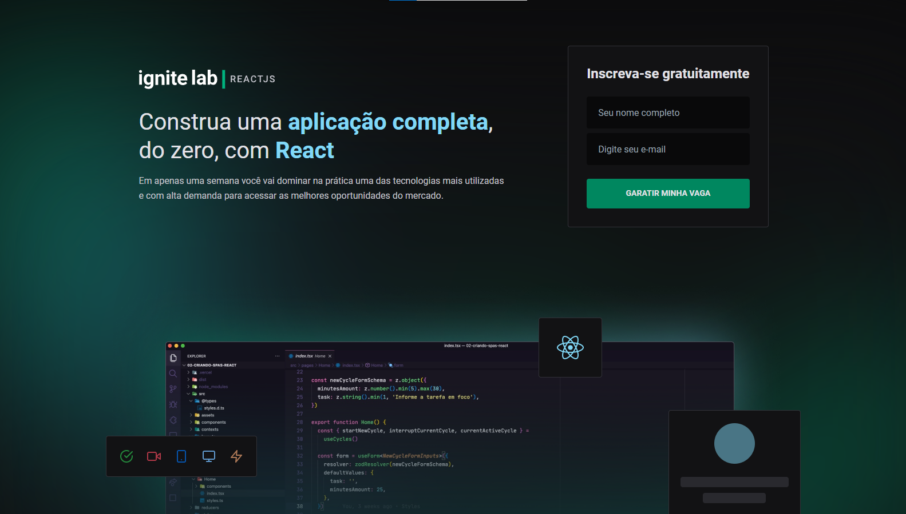

# 💻 Ignite Lab - ReactJS

<h1 align="center">
  
  <h4 align="center"><a href="https://video-plataform.vercel.app/" target="_blank">Clique para visitar o site</a></h4>
  <h4 align="center"><a href="https://www.figma.com/file/7Diez524svfSGk7JPqsxOv/Plataforma-de-evento---Ignite-Lab-(Community)?node-id=0%3A1" target="_blank">Clique para visitar o figma</a></h4>
</h1>

---

## 📚 Seções

O aplicativo contém as seguintes seções:

- **Home:** Apresentação do site e tela de cadastro;
- **Event:** Tela com todas as video aulas;
- **Lesson:** Tela com o conteúdo de uma atividade;

---

## 🛠️ Desenvolvido com

Para o desenvolvimento deste aplicativo eu usei as seguintes tecnologias:

- Vine;
- React;
- GraphQL;
- GraphCMS;
- Tailwind CSS;

---

## ⚙️ Descrição

O projeto é muito superficial, pretendo melhorar o mesmo ainda!

- adicionar página inicial com todos os cursos
- adicionar funcionalidade de login
- adicionar funcionalidade para registrar cursos
- estilizar alguns tratamentos

---

## ✒️ Autor

<table>
  <tr>
    <td align="center">
      <a href="https://github.com/Gabriellimmaa">
         
        
          <b>Gabriel Lima</b>
        
      </a>
    </td>
  </tr>
</table>

---

Obrigado por me ceder seu tempo lendo sobre o meu trabalho.

Qualquer dúvida, crítica ou sugestão entre em, <a href="mailto:gabriellimamoraes@gmail.com/">contato</a> pelo meu e-mail
